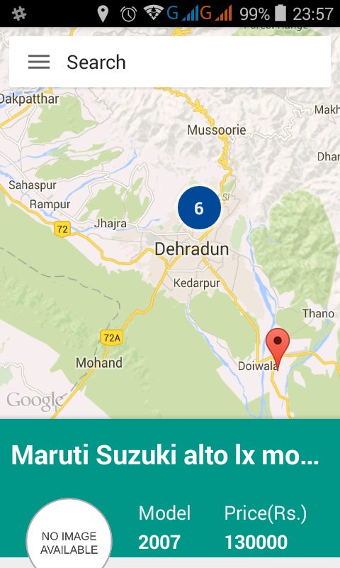
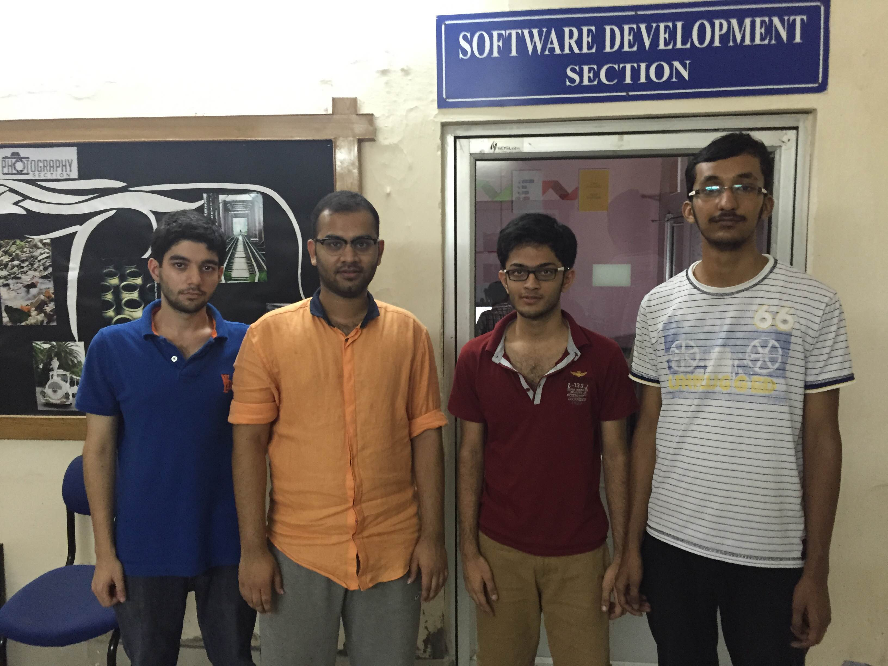

## QuiCAR

> Android App combining the power of Quikr API and Google Maps API. Displays sellers geographically on a google map nearby. Users can search for a product.

_Currently supports only cars_

### Screenshot

### Demo Youtube URL

[https://www.youtube.com/watch?v=81IXwKzI-zg](https://www.youtube.com/watch?v=81IXwKzI-zg)

## Structure

### QuiCAR-Server

The server that powers QuiCAR. Handles interaction with the Quikr API. Provides a REST, JSON based searchable API for our android app.

### QuiCAR-Android

The android application used by the users.

## Developers

### Team xterm_inate

Arpit Singla

Punit Dhoot

Dhaval Kapil

Abhishek Kandoi
